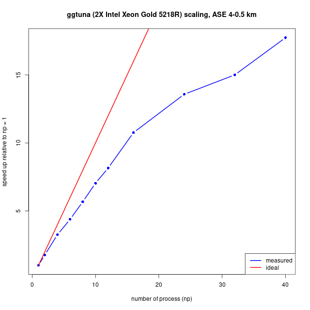

# [BISICLES build instructions](#top)

To build (and run) BISICLES you need to

1.  Meet the [system requirements](#sysreq)
2.  [Check out](#svnco) the source code
3.  Set up some third party [dependencies](#deps)
4.  [Configure Chombo](#chombo) by editing some definitions in a
    makefile
5.  [Configure BISICLES](#bikeconf) additional options by editing some
    definitions in another makefile
6.  [Compile driver](#bisicles), the main standalone BISICLES
    executable.
7.  [Run driver on a simple problem](#example) to ensure that it works

## [System requirements.](#sysreq)

BISICLES requires the GNU/Linux operating system (actually, it should
compile and run elsewhere, but we never do that), plus both C++ and
FORTRAN compilers, a GNU-compatible make, subversion, and Perl. Python
is optional but highly recommended - BISICLES has numerous optional
python components. On the whole, life is easiest with gcc (including g++
and gfortran), and we shall assume that is what will be used. To build
the parallel version, you need an MPI environment, which provides the
mpicc and mpicxx (or equivalents). 

You will also need
[VisIt](https://visit-dav.github.io/visit-website/index.html) to view the data BISICLES produces (other programs can be put to use,
but VisIt is by far the most convenient)

There are some [site specific notes](sites.md): look at these before
proceeding if you are installing on an Ubuntu or Debian workstation, on
a Cray (e.g ARCHER, NERSC), or on any of the other machines that
BISICLES has been used before.

## [Check out the source code.](#svnco)

Since this readme file lives in the source code repository, you might
have already checked the source code out. There are two source trees,
Chombo, and BISICLES, and the rest of this guide assumes that you have a
directory called  $BISICLES_HOME which contains the two.

Create a root directory for both source trees

      > export BISICLES_HOME=/wherever/you/like #assumes bash...
      > mkdir -p $BISICLES_HOME
      > cd $BISICLES_HOME

Then obtain a Chombo source tree.

    git clone https://github.com/applied-numerical-algorithms-group-lbnl/Chombo_3.2.git Chombo

Next, decide which BISICLES branch you want. Users will want the main
BISICLES development branch (trunk),which is fairly stable since
experimental code is developed on other branches. In that case run

      > git clone -b master https://github.com/ggslc/bisicles-uob BISICLES

You may want one of the other branches, especially if you are working
with any of the BISICLES developers to introduce new features, but in
that case you will probably know which one you need.

Note that you do not need to layout your source directories as indicated
above, or even follow the rest of these notes exactly. If you want some
other layout, note the following

-   Chombo needs to know where your hdf5 includes and libraries are to
    be found. It expects these to be defined in variables HDFINCFLAGS ,
    HDFLIBFLAGS , HDFMPIINCFLAGS, HDFMPILIBFLAGS, which are read from a
    file `/path/to/Chombo/lib/mk/Make.defs.local`, which you must
    create.
-   Chombo will determine the location of PETSc (if needed) from the
    PETSC_DIR environment variable
-   BISICLES needs to know where the Chombo includes and libraries are
    to be found (and possibly the same for python and netcdf). By
    default it assumes that there is a `Chombo` source tree at the same
    level as the BISICLES source tree, but this can be overridden by
    setting the environment variable `$CHOMBO_HOME`. e.g if you have
    Chombo in `/path/to/Chombo/3.2` then set
    `CHOMBO_HOME=/path/to/Chombo/3.2/lib`
-   BISICLES may need to know where python and netcdf includes and
    libraries are to be found, these are defined in
    `/path/to/BISICLES/code/mk/Make.defs` (as is `$CHOMBO_HOME`) which
    may attempt to read them from a file called
    `/path/to/BISICLES/code/mk/Make.defs.$UNAMEN`, where `$UNAME` is the
    output from `uname -n` or `Make.defs.none` if there is no such file.

## [Dependencies.](#deps)

-   **fftw:** Some optional components (e.g the BuelerGIA module
    contributed by Sam Kachuck) require [fftw](https://fftw.org). Most
    operating systems will allow you to install this in a sensible
    fashion. You need to know where it is installed - often /usr
-   **hdf5:** Chombo requires the hdf5 libraries.
-   **petsc:** Chombo 3.2 also contains an optional interface to the
    [PETSc](http://www.mcs.anl.gov/petsc/) solver library. We have found
    that using the Chombo AMR interface to the petsc algebraic multigrid
    solvers (either GAMG or Hypre 's BoomerAMG) can substantially
    improve the performance of the nonlinear ice velocity solve for
    problems where the native Chombo geometric multigrid (GMG) solvers
    struggle.
-   **netcdf:** BISICLES includes some complementary tools which require
    netcdf, and can be linked with the Glimmer-CISM model, which also
    requires netcdf. As with hdf5, there may be a suitable version
    installed on your system but you may need to compile netCDF from
    source.
-   **python:** BISICLES has an optional python interface
-   **gdal:** used by the complentary flatten tool to add projcetion
    data to output files

If you 're working on a system which is maintained by somebody else
(like, for example, the supercomputers at NERSC), it 's likely that
most, if not all, of these dependencies have been built and installed
already, which can save you some effort. So, check to see what 's
already installed, with an eye open to the possibility that things have
been configured in some odd way which makes them unusable for us, in
which case you you 're back to where you were anyway). See the [site
specific notes](sites.md), because certain common environments, such
as the Cray XC30/40, and recent versions of Debian and Ubuntu GNU/Linux,
have well designed systems for satisfying some of these dependencies,
notably fftw, hdf5 and netcdf. **Do not follow the instructions below
for hdf5 and netcdf on those machines, instead follow the much simpler
instructions in the [site specific notes](sites.md)**

There should be a script, download_dependencies.sh (in the same
directory as this file,  $BISICLES_HOME/BISICLES/docs) that will get the
(version 1.10.10) hdf5 sources and unpack them, twice : once into
hdf5/serial/src and once into hdf5/parallel/src. It assumes
 $BISICLES_HOME is set. It should contain the following

    cd $BISICLES_HOME
    echo `pwd`

    #get hdf5 sources
    if !(test -e hdf5-1.10.10.tar.bz2) then
        echo "downloading hdf5-1.10.9.tar.gz"
        wget https://support.hdfgroup.org/ftp/HDF5/releases/hdf5-1.10/hdf5-1.10.10/src/hdf5-1.10.10.tar.bz2
    fi

    mkdir -p hdf5/parallel/src
    tar -jxf  hdf5-1.10.10.tar.bz2 -C hdf5/parallel/src

    mkdir -p hdf5/serial/src
    tar -jxf  hdf5-1.10.10.tar.bz2 -C hdf5/serial/src

    #get netcdf sources

    if !(test -e netcdf-c-4.9.2.tar.gz) then
        echo "downloading netcdf-4.9.2.tar.gz"
        wget https://downloads.unidata.ucar.edu/netcdf-c/4.9.2/netcdf-c-4.9.2.tar.gz
    fi
    mkdir -p netcdf/parallel/src
    tar -zxf netcdf-c-4.9.2.tar.gz -C netcdf/parallel/src

    mkdir -p netcdf/serial/src
    tar -zxf netcdf-c-4.9.2.tar.gz -C netcdf/serial/src

If you want to build a single-processor BISICLES, then build hdf5 in
hdf5/serial/src. If you want to build a multi-processor BISICLES, then
build hdf5 in hdf5/parallel/src. Similar pairs of directories will be
built for netcdf.

### Building serial hdf5

Before starting, make sure that you can run gcc. Enter the appropriate
source directory

    > cd $BISICLES_HOME/hdf5/serial/src/hdf5-1.10.10/

and configure hdf5 like so

    CC=gcc CFLAGS=-fPIC ./configure --prefix=$BISICLES_HOME/hdf5/serial/

The -fPIC flag will be useful later if you want to build the
experimental [libamrfile](libamrfile.md) shared library that can be
used to manipulate Chombo (and BISICLES) output with languages that
support a plain C function calling convention, like FORTRAN 90, GNU R,
Python and MATLAB. Configure will spit out a long list of tests, and
hopefully pass them all. Don 't worry that the C++ and Fortran languages
are not enabled : Chombo uses the C interface, and (when we come to
compile that too), so does netcdf. Assuming this is all OK, type

    > make install

and you, after a round of compiling and copying, you should see that the
hdf5 libraries bin,doc,include and src have appeared in
 $BISICLES_HOME/hdf5/serial/.

### Building parallel hdf5

Before starting, make sure that the mpi environment is in place and that
you can run mpicc. Enter hdf5/parallel/src/hdf5-1.10.10/ directory

    > cd $BISICLES_HOME/hdf5/parallel/src/hdf5-1.10.10/

and configure hdf5, this time enabling MPI through the use of mpicc in
place of gcc

    > CC=mpicc ./configure --prefix=$BISICLES_HOME/hdf5/parallel/ --enable-parallel=yes

This time, configure 's final report should the line  'Parallel HDF5:
mpicc  ' Assuming this is all OK, type

    > make install

this time, the bin,doc,include and src directories should end up in
 $BISICLES_HOME/hdf5/parallel/.

### [Building serial netcdf](#cdf)

**The main BISICLES program does not need netcdf: you only need it to
convert between hdf5 (which BISICLES reads and write) and netcdf formats
(which are popular in climate modelling). If you have problems with
this, move on.** Before starting, make sure that you can run gcc,g++ and
gfortran. Enter the appropriate source directory

        > cd $BISICLES_HOME/netcdf/serial/src/netcdf-c-4.9.2/
      

Now, netcdf needs to link hdf5 : it doesn 't really matter which version
but we might as well use the one we have. So, we have a custom configure
line

    > CC=gcc CPPFLAGS=-I$BISICLES_HOME/hdf5/serial/include/ CXX=g++ FC=gfortran LDFLAGS=-L$BISICLES_HOME/hdf5/serial/lib/  ./configure --prefix=$BISICLES_HOME/netcdf/serial --enable-dap=no

Next, compile, test, and install netcdf

    > make check install

and assuming all goes well, the C API netcdf 4.9.2 will now be installed
in  $BISICLES_HOME/netcdf/serial.

Recent versions of netcdf (inclusing 4.9.2) do not include a Fortran
API. BISICLES does not require this, but related programs might.

### Building parallel netcdf

So far, the only difference between parallel and serial netcdf installs
is the link to parallel hdf5 and the use of the MPI compiler wrapper.
Possibly, building two versions of netcdf is a waste of time.

**parallel netcdf may be needed to compile parallel glimmer-CISM,
otherwise it can be skipped**.

    > cd $BISICLES_HOME/netcdf/parallel/src/netcdf-4.9.2/
    > CC=mpicc CXX=mpiCC FC=mpif90  CPPFLAGS="-DgFortran -I$BISICLES_HOME/hdf5/parallel/include/" LDFLAGS=-L$BISICLES_HOME/hdf5/parallel/lib/  ./configure --prefix=$BISICLES_HOME/netcdf/parallel --enable-dap=no
    > make  check install

### [Installing PETSc](#petsc)

If we 're planning to use the PETSc solver interface, it 's a good idea
to install PETSc before building Chombo. It 's likely that some version
of petsc may be pre-installed on your system  -- we need petsc version
3.3.4 or later, configured with hypre. If that is not available, you
will need to build it.

1.  First, download PETSc:

        > cd $BISICLES_HOME
        > git clone -b release https://gitlab.com/petsc/petsc.git petsc-src

2.  Configure petsc. To build a parallel version and install it in
     $BISICLES_HOME/petsc,

        > mkdir -p $BISICLES_HOME/petsc
        > cd $BISICLES_HOME/petsc-src
        > ./configure --download-fblaslapack=yes --download-hypre=yes -with-x=0 --with-c++support=yes --with-mpi=yes --with-hypre=yes --prefix=$BISICLES_HOME/petsc --with-c2md=0 --with-ssl=0

    The petsc install system is pretty helpful and will tell you what to
    do if it runs into problems (unlike, say, Chombo)

3.  Follow the instructions to make and install the library

4.  Finally, set the PETSC_DIR environment variable, which Chombo will
    use in order to find your PETSc installation. If using bash,

        > export PETSC_DIR=$BISICLES_HOME/petsc

    Use setenv rather than export in csh, tcsh etc. These variables need
    to be set whenever you compile against petsc, so consider adding
    them to .bash_profile or .bashrc or the startup script for your
    shell.

## [Chombo configuration](#chombo)

Next we need to set up Combo 's configuration (which BISICLES will
inherit automatically). The main task here is create a file called
 $BISICLES_HOME/Chombo/lib/mk/Make.defs.local, and there is version
stored in this directory that should be easy enough to edit. First, copy
it into  $BISICLES_HOME

    > cp $BISICLES_HOME/BISICLES/docs/Make.defs.local $BISICLES_HOME

At the very least, you will need to edit the line that reads

     
    BISICLES_HOME=..., 

to give the correct value. If you don 't have MPI, there are a few lines
to comment out. You might also want to tinker with the optimization
flags and so on. Then create a link so that Chombo sees Make.defs.local
in the place it expects

    >ln -s $BISICLES_HOME/Make.defs.local $BISICLES_HOME/Chombo/lib/mk/Make.defs.local

If you want the include compenents (e.g BuelerGIA) that require fftw set

    USE_FFTW=TRUE
    #make sure FFTWDIR is correct (contains e.g include/fftw3.h if you set USE_FFTW=TRUE
    FFTWDIR=/path/to/fftw # often /usr

## [Configuring BISICLES](#bikeconf)

A makefile containing options specific to BISICLES (rather than Chombo)
is located at

    $BISICLES_HOME/BISICLES/code/mk/Make.defs

You do not usually need to edit that file, but instead, add a file named
for your machine to that directory. Run  'uname -n ' to find out the
name of you machine, e.g on a host called  'mymachine '

    > cd $BISICLES_HOME/BISICLES/code/mk/
    > uname -n
    mymachine
    > cp Make.defs.template Make.defs.mymachine

Alternatively, create a file called Make.defs.none

### Python

To make use of the [python interface](pythoninterface.md), you need to
ensure that you have a suitable python installation. This is usually
straightforward in modern GNU/linux distributions, since Python is so
widespread. The aim is to make sure that the the variables PYTHON_INC
and PYTHON_LIBS are correctly defined. Make.defs.template attempts to
set these variables by running

    python3-config --includes
    python3-config --libs

which works on many workstations but may not be what you want. In that
case, you need to find out where the header file  "Python.h " lives, and
what linker flags you need. For example, edit Make.defs.mymachine to set

    PYTHON_INC=/usr/include/python3.10
    PYTHON_LIBS=-lpython3.10

There are several machine specific examples in the same directory. If
you do not want the python interface for some reason (we advise having
it), make sure that PYTHON_INC is not set

### NetCDF

Netcdf is not needed by the main BISICLES code, but there are tools and
examples to do depend upon it. The aim is to set the NETCDF_INC and
NETCDF_LIBS variables in (e.g) Make.defs.mymachine, and once again
Make.defs.template shows one way to do this if netcdf is installed, by
running

    nc-config --includedir
    nc-config --libs

If that is not suitable, for example if you built [netcdf as
above](#cdf), you need to find the location netcdf.h. Edit
Make.defs.mymachine to set

    NC_CONFIG=$(BISICLES_HOME)/netcdf/serial/bin/nc-config
    HDF_SER_DIR=$(BISICLES_HOME)/hdf5/serial
    NETCDF_HOME=$(shell $(NC_CONFIG) --prefix)
    NETCDF_INC=-I$(shell $(NC_CONFIG) --includedir)
    NETCDF_LIBS=$(shell $(NC_CONFIG) --libs) -Wl,-rpath $(NETCDF_HOME)/lib -lhdf5_hl -lhdf5 -Wl,-rpath $(HDF_SER_DIR)/lib

## [Building basic (standalone) BISICLES](#bisicles)

Now we are ready to build one or more BISICLES executables. If you plan
to do development work on the code itself, you will want to build an
unoptimized version to run in gdb. Run

    > cd $BISICLES_HOME/BISICLES/code/exec2D
    > make all

This will build a set of Chombo libraries, and then BISICLES. Hopefully,
it will complete without errors, and you will end up with an executable
called driver2d.Linux.64.g++.gfortran.DEBUG.ex. This one is most useful
for low-level debugging of the code - if you are not planning to do
that, there is no need for it. If you have a serial computer only, run

    > cd $BISICLES_HOME/BISICLES/code/exec2D
    > make all OPT=TRUE

to get an optimized executable called
driver2d.Linux.64.g++.gfortran.DEBUG.OPT.ex.

An optimized parallel executable
driver2d.Linux.64.mpic++.gfortran.DEBUG.OPT.MPI.ex can be built like so

    > cd $BISICLES_HOME/BISICLES/code/exec2D
    > make all OPT=TRUE MPI=TRUE

For serious runs, this is the one you need. Even on workstations with a
few processors (like dartagnan.ggy.bris.ac.uk) noticeable (2X-4X) speed
improvements are realized by running parallel code, and on clusters like
bluecrystal or hopper.nersc.gov we have obtained 100X speedups for big
enough problems (and hope to obtain 1000X speedups).

Finally, should you feel the urge, you can have a non-optimized parallel
version, which can be used for hunting down low-level bugs that crop up
in parallel operation but not in serial operation.

To build with PETSc support, add  "USE_PETSC=TRUE " to your build line,
e.g.

    > cd $BISICLES_HOME/BISICLES/code/exec2D
    > make all OPT=TRUE MPI=TRUE USE_PETSC=TRUE

### [Make clean](#makeclean)

On occasion it might be necessary to rebuild BISICLES entirely, rather
than just those parts where a file has changed. To do so, run

    cd $BISICLES_HOME/BISICLES/code

then

    make clean

for unoptimized, serial builds,

    make clean OPT=TRUE

for optimized serial builds, and

    make clean OPT=TRUE MPI=TRUE

for optimized parallel builds

### [Make realclean](#makerealclean)

In the event even more houscleaning is desired, the  "realclean " target
does everything the  "clean " target does, and additionally removes many
other user-generated files, including all files with the  ".hdf5 "
suffix (including checkpoint and plot files).

## [Running BISICLES on a simple problem](#example)

All the data to run [Frank Pattyn 's MISMIP3D P075
experiment](http://homepages.ulb.ac.be/~fpattyn/mismip3d/welcome.md)
is already present. Change to the MISMIP3D subdirectory, and generate
some input files from a template.

    > cd $BISICLES_HOME/BISICLES/examples/MISMIP3D
    > sh make_inputs.sh

then we are ready to go.

### Running on a serial Workstation

On a serial machine, try the 3 AMR level problem (which will have a
resolution of 800 m at the grounding line, and 6.25 km far from it).

    $BISICLES_HOME/BISICLES/code/exec2D/driver2d.Linux.64.g++.gfortran.DEBUG.OPT.ex  inputs.mismip3D.p075.l1l2.l3 > sout.0 2>err.0 &

You can watch progress by typing

    > tail -f sout.0

and eventually, you will get a series of plot *2d.hdf5 files that you
can view in visit

### Running on a parallel Workstation

If you have a parallel machine, run the 5 AMR level problem (which will
have a resolution of 200 m at the grounding line, and 6.25 km far from
it).

    > nohup mpirun -np 4 $BISICLES_HOME/BISICLES/code/exec2D/driver2d.Linux.64.mpic++.gfortran.DEBUG.OPT.MPI.ex inputs.mismip3D.p075.l1l2.l5 &

replace -np 4 with the appropriate count for your machine: this may be
many as the number of CPU cores, but perhaps fewer, because these will
typically share some resources. Ideally, do a series of scaling
experiments to come up with a graph like the example below. This example
is based on real world problem set in the Amundsen Sea Embayment, and
includes both in-memory calculations (CPU) and file I/O. File I/O is
often expensive, especially on clusters. The example below measures the
time taken to evolve the model over 16 timesteps and write both a
checkpoint and plot file (each around 200 MB).

See also the [Site specific notes](sites.md).

You can watch progress by typing

    > tail -f pout.0

and eventually, you will get a series of plot *2d.hdf5 files that you
can view in visit

### Running on a cluster

See the [Site specific notes](sites.md)

## [Building all of BISICLES](#all)

Once BISICLES is working on a given machine, it might be convenient to
build everything - standalone BISICLES, [the R/Python/MATLAB analysis
tools](libamrfile.md)

, the programmable [cdriver interface](cdriver.md), the [file
tools](filetools.md), and so on. To build everything, run e.g

    cd $BISICLES_HOME/BISICLES/code
    make all OPT=TRUE MPI=TRUE

or specify the options you prefer.
