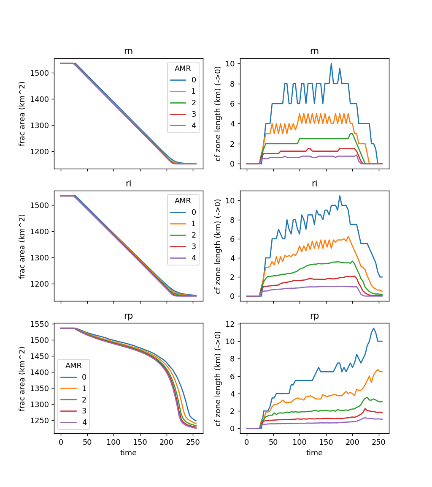
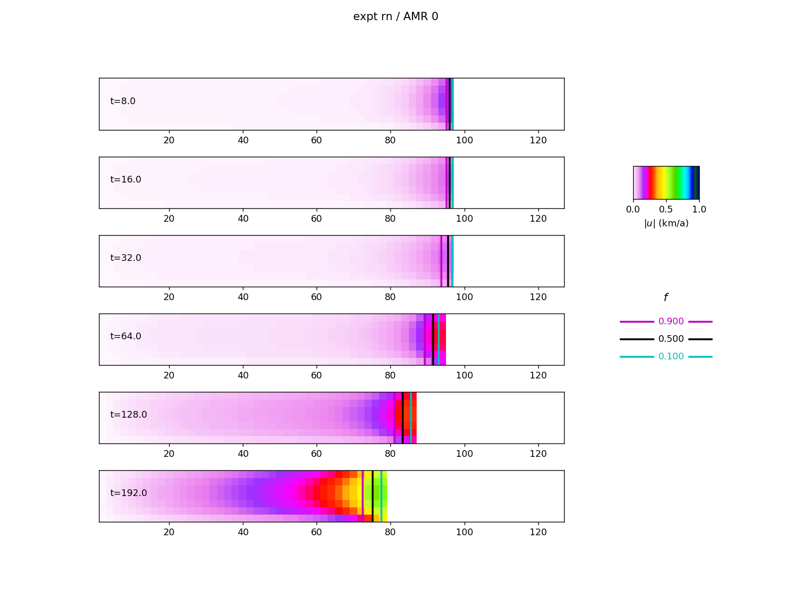
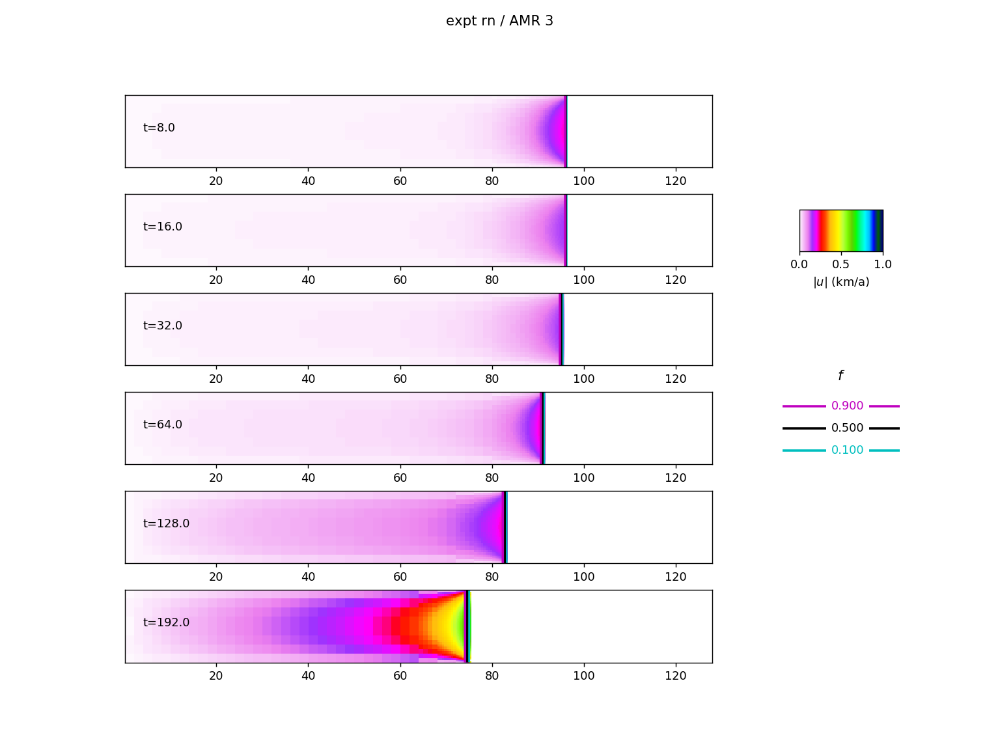
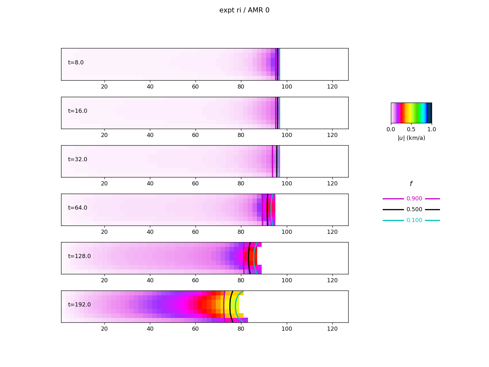
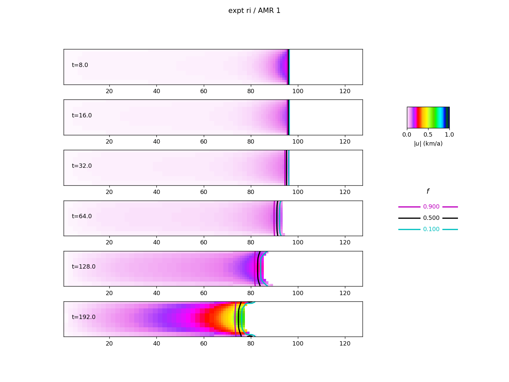
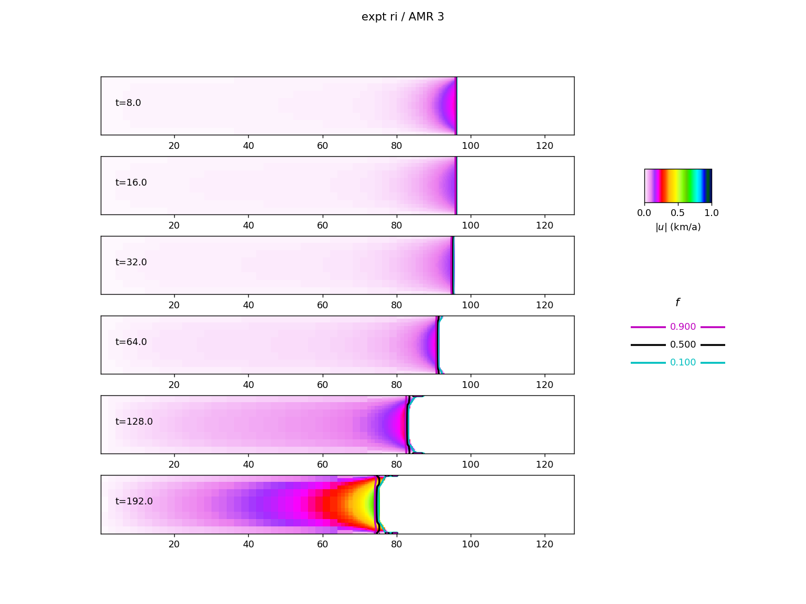
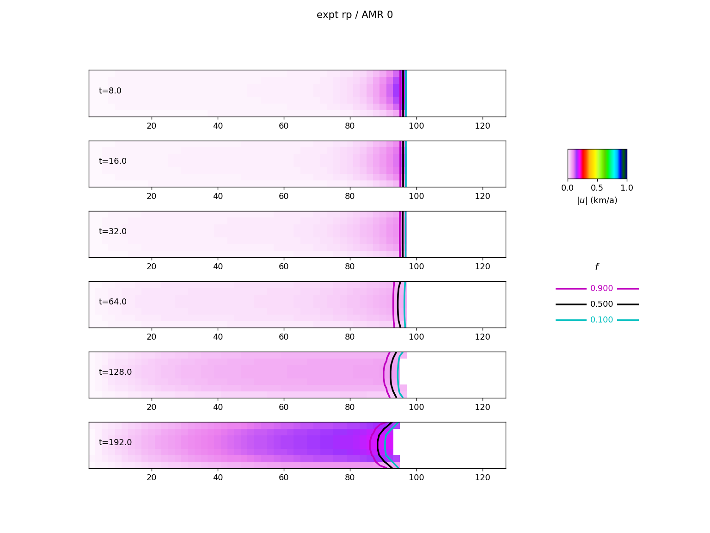
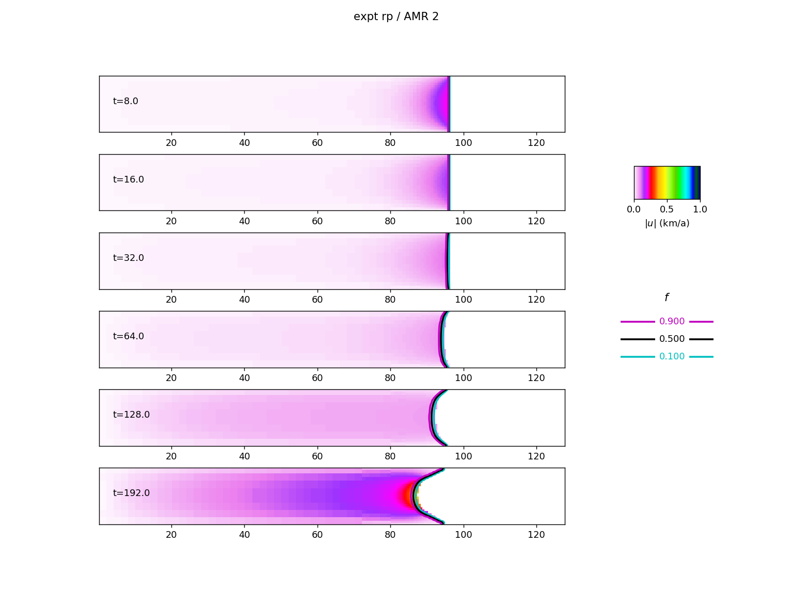
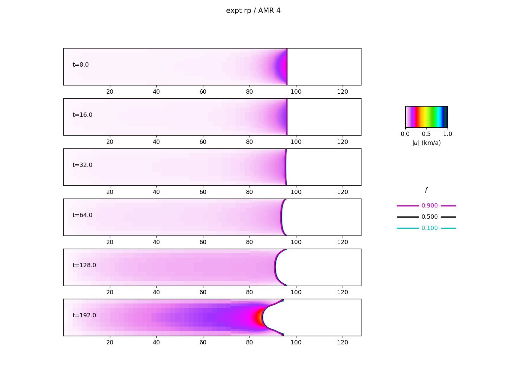

# Purpose

Demonstrates user of amr.evolve_ice_frac2 = true

Ice area fraction $f$ evolves according to the non-conservative advection equation

$\frac{\partial f}{\partial t} + (\vec{u} - \vec{u}_c) \cdot \nabla f = 0$

- $f$ - fractional ice coverered area within cell
- $\vec{u}$: ice velocity
- $\vec{u}_c$: calving vector.

$\vec{u}_c$ is defined in terms of a scalar calving rate ($\alpha$) and a choice of direction. 
Three cases are included.

- rn: $\vec{u}_c = \vec{u} - \alpha \nabla f / |\nabla f|$ (calving applied normal to front)
- ri: $\vec{u}_c = \vec{u} + \alpha \vec{u} / |\vec{u}|$ (calving against ice velocity direction but independent of magnitude)
- rp: $\vec{u}_c = (1 + \gamma) \vec{u}$ (calving proportional to ice velocity)

For rn, ri, set $\alpha = 128 {\rm m/a}$. For rp, $\gamma = \alpha / 256 $ 

# Simulations

- Idealized tidewater glacier with fjord
	- Straight channel, 128 km $\times$ 16 km domain
	- No-slip conditions at $x = 0$, $y = 0$, $y = 16 km$
	- Bedrock $b = 100 (x - x_1)/(-x1)$, $x_1 = 72 $ km 
	- Initial state provides a calving front at $x = 96 km$
- Front held steady for $ 0 < t \leq 8 $ years by setting calving rate $u_c = u$
- Front retreats when $ 8 < t < 256 $, three cases: rn,ri,rp. Calving > 0 only when $b < 0$, ie $x > x1$
- Each case repeated over 0-4 levels of refinement: AMR0-4

# How to run

1. mk_inputs.sh  produces inputs.\* files for each case
	- calving rates, geometry etc provided by channel_frac.py 
2. mk_ouputs.sh  runs BISICLES for each case.
	- runs all jobs in the background, as simultaneous serial jobs
3. plot_channel_frac.py  produces the plots. Needs libamrfile to read the hdf5 files

# Results

## Ice area and calving zone area

Plots below show total ice covered area

$A = \int_\Omega f {\rm d} \Omega$

and the length of the calving zone $L$, $L^2$ is the area where $\epsilon < f < 1 - \epsilon$. In a true VOF method,
$L = \Delta X$ if the front is a straight line, i.e only one layer of part-filled cells. For our pseudo-VOF method,
$L = B \Delta X, B > 1$.

### (rn): Set retreat rate, directed along $\nabla f$
- retreat rate constant after $t = 8$ until front reaches $b = 0$.  
- calving zone length, $L \sim \Delta x$.

### (ri) Set retreat rate, directed along $u$

- retreat rate constant after $t = 8$ until front reaches $b = 0$.  
- calving zone length $\sim \Delta x$

### (rp) Retreat rate proportional to $u$

- retreat increases afer $b = 0$.  
- calving zone length $\sim \Delta x$

##Snaphot images

### (rn): Set retreat rate, directed along $\nabla f$

$u_c = \alpha \nabla f/ |\nabla f|$

### (ri) Set retreat rate, directed along $u$

$u_c = \alpha u/|u|$ 

### (rp) Retreat rate proportional to $u$

$u_c = \alpha u$

